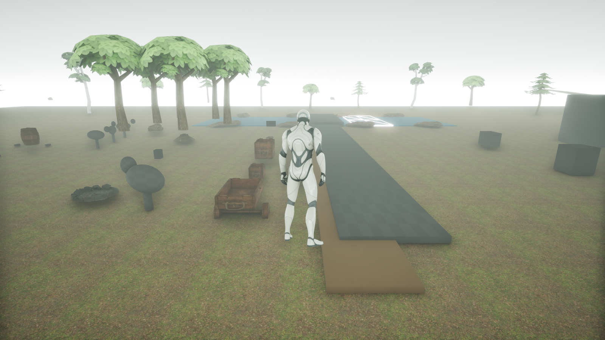
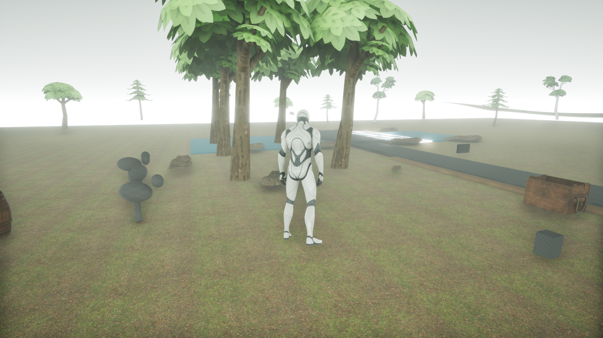
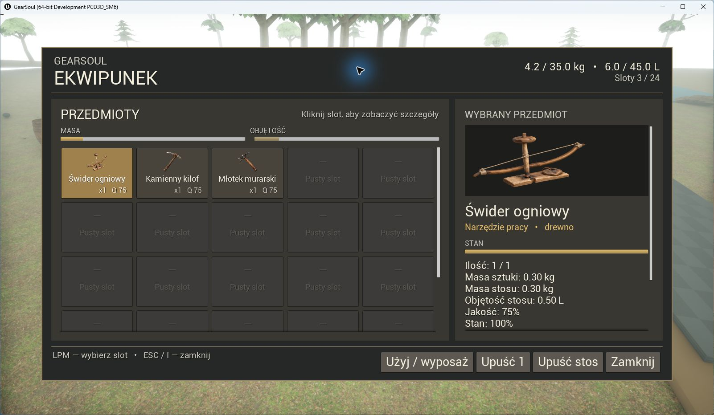

# GearSoul — Pre-Alpha Multiplayer Playtest

**GearSoul** to rozwijana w Unreal Engine gra o przetrwaniu, pracy, nauce zawodów i budowaniu własnej historii. Nie narzuca graczowi roli wojownika — postać może rozwijać się przez pracę, rzemiosło, handel, budowę oraz współpracę z innymi.

> To wczesna wersja techniczna. Grafika, interfejs, balans i zawartość nadal się zmieniają.

## Pobierz aktualną wersję

### [Pobierz GearSoul v0.4.0 Pre-Alpha Multiplayer (Windows)](https://github.com/Aniosek/GearSoul-Playtest/releases/download/v0.4.0/GearSoul_v0.4.0_PreAlpha_Multiplayer_Windows.zip)

Rozmiar archiwum: około **613 MiB**.

1. Pobierz i rozpakuj cały plik ZIP.
2. Nie uruchamiaj gry bezpośrednio z wnętrza archiwum.
3. Uruchom `START_GearSoul_Solo.bat`, `START_GearSoul_Host.bat` albo `START_GearSoul_Join.bat`.

Przy połączeniu przez Internet host musi dopuścić grę w Zaporze Windows i przekierować **UDP 7777**. Ta wersja używa listen-servera.

## GearSoul v0.4.0 na screenach







## Co zmieniło się w v0.4.0

- mapa testowa ma teraz naturalny teren, rzekę, las i lekkie stylizowane drzewa,
- ekwipunek otrzymał czytelny układ i prawidłowe skalowanie w 1600×900,
- las pamięta wycinkę, stan gleby, erozję i fizyczne sadzonki,
- most wymaga ośmiu osobnych kłód oraz pracy młotkiem i reaguje na przeciążony wóz,
- kuźnia wytwarza i naprawia żelazny kilof, siekierę oraz młotek z prawdziwych części,
- trzy regiony mają różne warunki magazynowania oraz fizyczne psucie żywności,
- nowe wizualizacje jedzenia i narzędzi pozostają lekkie dla multiplayera.

## Najważniejsze testy

- hostowanie i dołączanie dwóch lub większej liczby graczy,
- wspólne podnoszenie, przenoszenie i używanie fizycznych przedmiotów,
- masa, objętość, sloty oraz działanie plecaka,
- barter, pojemniki, wóz, budowanie i uprawnienia claimu,
- wydobycie, ścinanie drzew, produkcja, ognisko, rolnictwo i medycyna,
- synchronizacja dnia, nocy, przetrwania oraz zdarzeń środowiskowych,
- wygląd i położenie siekiery, kilofa i młotka w prawej dłoni innych graczy,
- wspólny postęp dostarczania materiałów i pracy na placu budowy,
- stabilne rozmieszczanie surowców bez nakładania i wystrzeliwania obiektów,
- oczyszczanie i magazynowanie fizycznej wody,
- ruch stada, karmienie, pojenie i prowadzenie wołu z wozem,
- odnowa lasu, budowa mostu, kowalstwo i regionalne magazyny żywności.

Pełna lista znajduje się w `README_PL.md` wewnątrz paczki oraz w [checkliście testera](TESTING_CHECKLIST_PL.md).

## Zgłaszanie błędów

Błędy, uwagi i materiały z testów wysyłaj na **[gearsoul00@gmail.com](mailto:gearsoul00@gmail.com)**.

W wiadomości podaj tryb (solo/host/klient), liczbę graczy, kroki prowadzące do błędu, oczekiwany rezultat oraz dołącz screen, film lub log, jeśli jest dostępny. Nie przesyłaj publicznie swojego adresu IP ani danych konta.

## Integralność pobrania

SHA-256:

```text
B5A08B41F7F09EB3970140F5721F86FE346542ED0040A8DB08881F920BDD89BF
```

## Status projektu

- **Wersja:** v0.4.0 Pre-Alpha Multiplayer Playtest
- **Platforma:** Windows 64-bit
- **Silnik:** Unreal Engine 5.8
- **Stan:** aktywny rozwój

Kod źródłowy gry nie jest publikowany w tym repozytorium. Zawartość wydania jest spakowana jako Unreal Pak/IoStore; nie da się jednak zagwarantować absolutnej niemożliwości analizy aplikacji uruchamianej na komputerze testera.

Copyright © 2026 Aniosek — kod i autorska zawartość GearSoul. Publiczna paczka służy do testowania i nie udziela praw do kodu ani autorskich zasobów projektu. Informacje o wykorzystanych zasobach CC0 znajdują się wewnątrz paczki.
