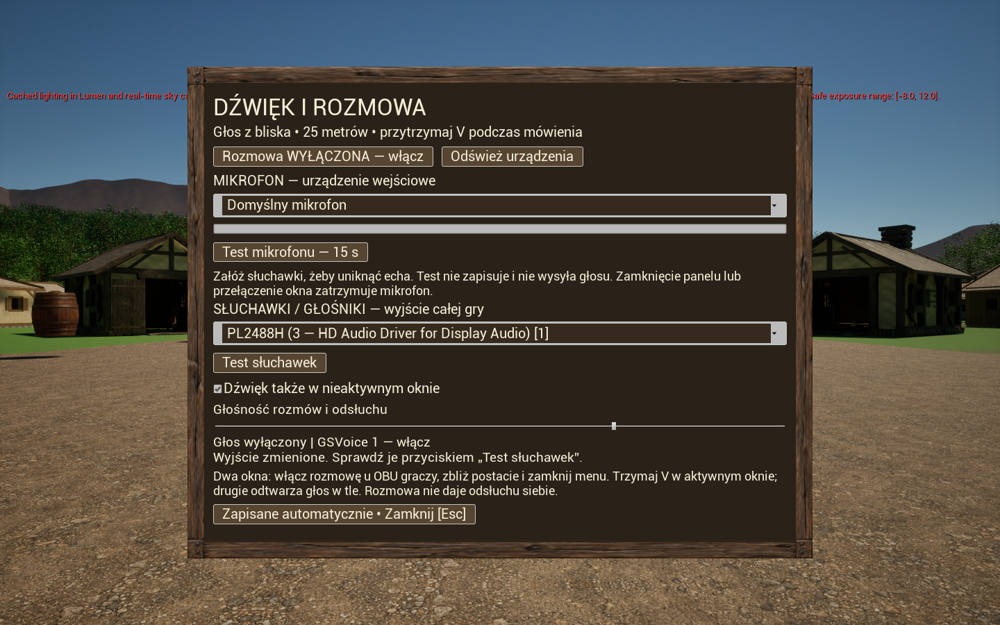
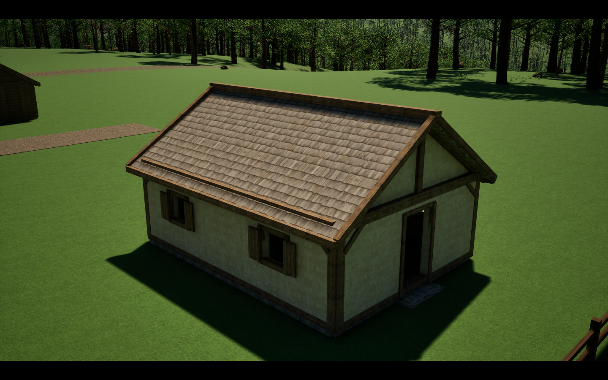
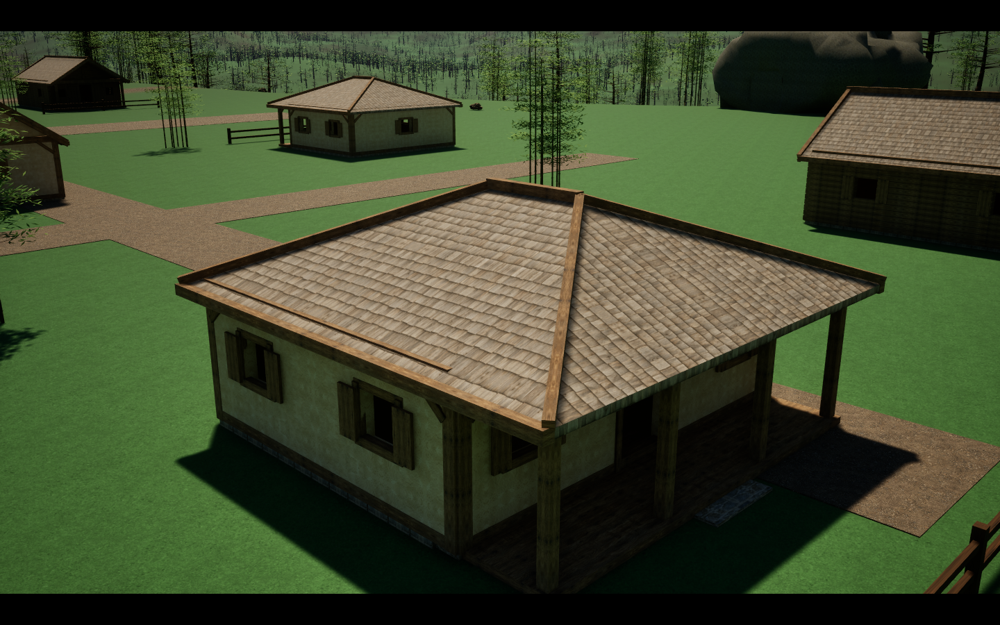
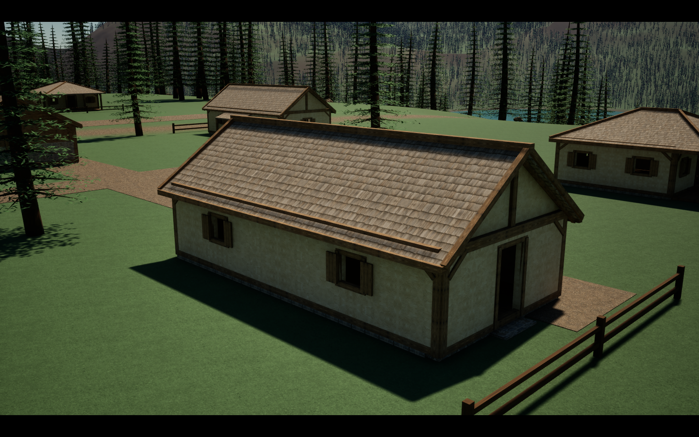
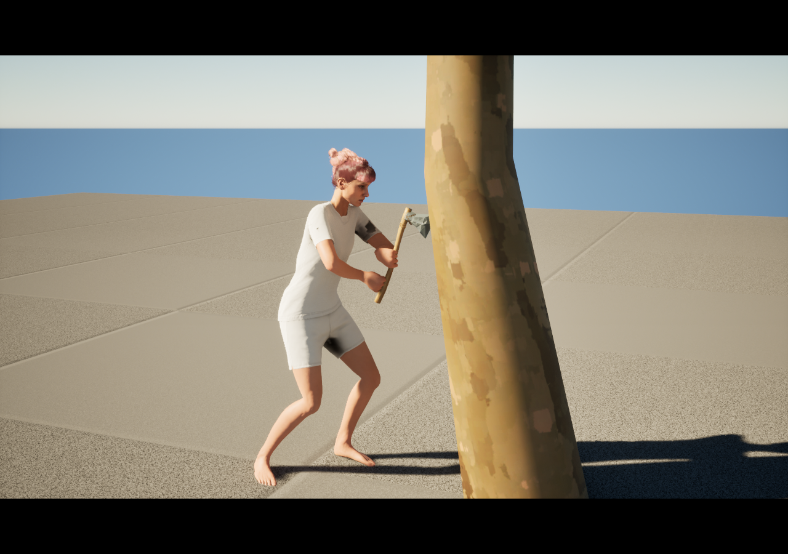
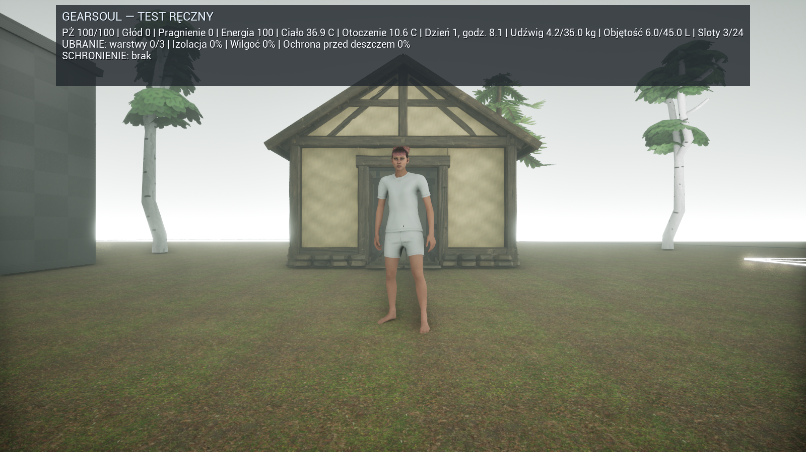
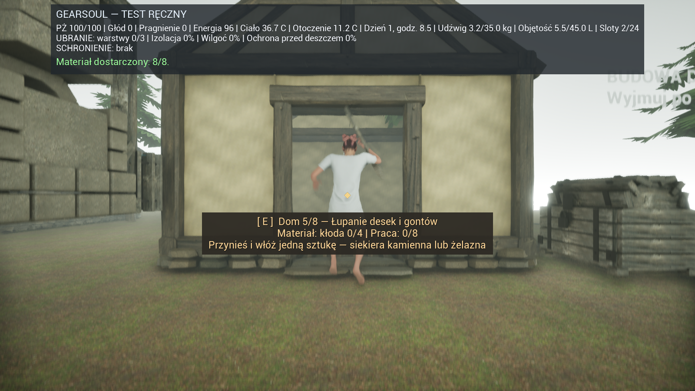
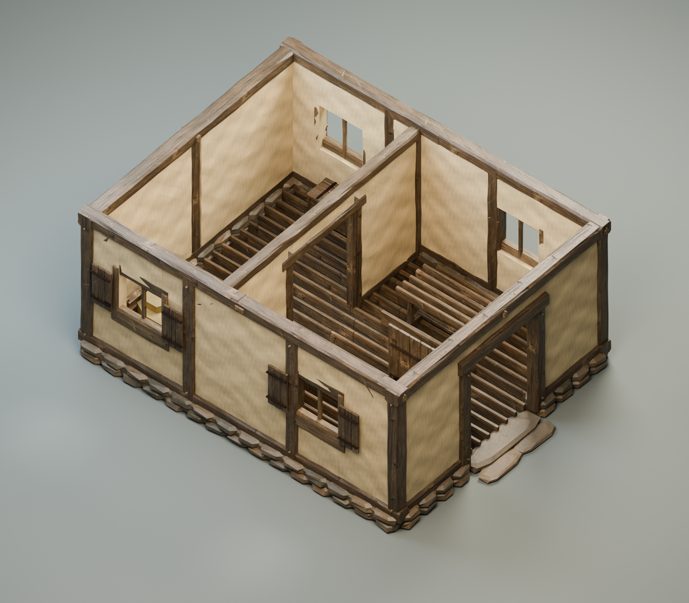

# GearSoul — Pre-Alpha Multiplayer Playtest

**GearSoul** to rozwijana w Unreal Engine gra o przetrwaniu, pracy, nauce zawodów i budowaniu własnej historii. Nie narzuca graczowi roli wojownika — postać może rozwijać się przez pracę, rzemiosło, handel, budowę oraz współpracę z innymi.

> To wczesna wersja techniczna. Grafika, interfejs, balans i zawartość nadal się zmieniają.

**Główna idea:** świat działa dlatego, że tworzą go gracze. Zobacz [wizję GearSoul](GEARSOUL_VISION.md) oraz [publiczną roadmapę](ROADMAP.md).

## Pobierz aktualną wersję

### [Pobierz GearSoul v0.9.10 Pre-Alpha Multiplayer (Windows)](https://github.com/Aniosek/GearSoul-Playtest/releases/download/v0.9.10/GearSoul_v0.9.10_PreAlpha_Multiplayer_Windows.zip)

Paczka wykonywalna jest w powyższym ZIP-ie, nie w „Code → Download ZIP” ani w automatycznych archiwach „Source code”. [Opis wydania i pliki](https://github.com/Aniosek/GearSoul-Playtest/releases/tag/v0.9.10) · [Sumy SHA-256](SHA256SUMS.txt). **To wciąż pre-alpha, nie gotowe 1.0.0.**

ZIP: **1,83 GB**, 50 plików, kontrolnie rozpakowany i porównany plik po pliku (SHA-256). Host i klienci powinni pobrać tę samą wersję i rozpakować ją do nowego folderu. [Wyniki testów oraz ograniczenia](RELEASE_v0.9.10.md).

1. Pobierz i rozpakuj cały plik ZIP.
2. Nie uruchamiaj gry bezpośrednio z wnętrza archiwum.
3. Uruchom `START_GearSoul_Regiony.bat`, aby wybrać **Alderen, Sairen lub Norvak** i tryb solo/host. Zwykłe EXE oraz launcher Solo otwierają Alderen. Pozostali gracze używają `START_GearSoul_Join.bat`.

Przy połączeniu przez Internet host musi dopuścić grę w Zaporze Windows i przekierować **UDP 7777**. Ta wersja używa listen-servera.

## Aktualne v0.9.10 — zwierzęta, łowienie i nocne światło

- Nowe kudłate zwierzęta z animowanymi łapami i sierścią podążającą za ciałem; po trzy w każdym regionie.
- Wędka z długą linką i spławikiem, łowienie na przynętę, surowe i pieczone ryby oraz receptury. **E** przy łowisku rozpoczyna łowienie i służy do wyciągnięcia ryby po braniu.
- Pochodnia z paliwem i animowanym płomieniem. **L** zapala trzymaną pochodnię, jeśli masz sprawny świder ogniowy. Światło pada na otoczenie i rzuca cienie.
- Księżyc, nocne światło i ciepłe oświetlenie istniejących domów. Obraz Leszka w jednym z domów w Alderen.
- Poprawione sztywne łapy zwierząt, przywiązanie sierści do animacji, podwójny spławik, orientacja płomienia i zdjęcia. Anulowanie łowienia oddaje stanowisko i nie blokuje postaci; pełny plecak nie zabiera przynęty przy odmowie.

Szczegółowe sterowanie, wymagane przedmioty i checklistę znajdziesz w [README_PL.md](README_PL.md). Nie jest to deklaracja ukończenia gry: animacja rzutu, dalsza optymalizacja sierści i automatyczne światła w nowych domach gracza pozostają do rozwinięcia. Wydajność 15 renderujących klientów nie została potwierdzona. Do tego wydania nie dodajemy nowych screenów.

## Poprzednie v0.9.9 — trzy regiony, budowanie i rozmowa

- Trzy mapy regionalne z terenem, osadami i fauną. W każdym regionie 20 domów w 5 wariantach oraz punkty startowego wydobycia. To oddzielne mapy; transfer pomiędzy niezależnymi serwerami nie jest jeszcze gotowy.
- **F10: wybór mikrofonu i słuchawek**, miernik sygnału, odsłuch lokalny do 15 s, test wyjścia i dźwięk w nieaktywnym oknie. Rozmowa jest dobrowolna, na 25 m, przy przytrzymaniu V. Odsłuch mikrofonu nie nagrywa ani nie wysyła głosu innym.
- Dostawy materiałów na plac budowy, etapy pracy, noszenie ciężkich kłód, profil i oddzielne pule do 50 Punktów Wiedzy / 40 Punktów Rozwoju.
- Kopalnia zaczyna się zamkniętą skałą: wykucie odcinka → dostawa 3 kłód → obróbka siekierą → mocowanie młotkiem. Bez ukończonej podpory nie drążysz dalej. Na razie 6 odcinków / 12 m; nie ma swobodnych rozgałęzień ani prawdziwych zawałów. Oświetlenie kopalni i regionów nadal wymaga dopracowania.
- Stara plansza jest tylko dodatkiem `TEST_Mechanik_Stara_Plansza.bat`, nie mapą domyślną. Księga przywołań pozostaje pomocą testową; udźwig nadal obowiązuje.

**Co sprawdzić:** [aktualna instrukcja i checklista v0.9.10](README_PL.md). Launchery uruchamiają świeży scenariusz bez trwałego zapisu. Nie kasuj swoich starszych zapisów. Nie potwierdzono wydajności 15 renderujących klientów, rozmowy na wszystkich fizycznych mikrofonach ani połączeń WAN w tej wersji. Poniższe screeny są archiwalne, z 0.9.9.

[Szczegóły i wyniki testów 0.9.9](RELEASE_v0.9.9.md).

## Poprzednie v0.9.5 — ścinanie oburącz i mapa kontrolna

- Poprawiony chwyt siekiery obiema dłońmi przez IK, praca barków, łokci, tułowia, bioder i kolan. Ostrze trafia w powierzchnię pnia i na chwilę wyhamowuje. Ruch można przerwać; nie powinien blokować sterowania.
- Kamienne, miedziane, żelazne i stalowe narzędzia mają oddzielne elementy wykonania i różną trwałość. Testuj montaż, zużycie oraz warsztat z drugim graczem.
- Księga testowa przywołuje potrzebne przedmioty na oznaczonym polu; udźwig nadal obowiązuje. Sprawdź osadę, schronienie w budynkach, wóz, zaprzęg i barter.
- To przyrosty projektu do etapu 95, **nie deklaracja 95% ukończenia gry**. Nadal powstają kolejne animacje, oprawa oraz mechaniki.

Poniższy screen i animacja pochodzą z historycznego 0.9.5. Aktualna instrukcja dotyczy 0.9.10.

**Błędy:** [GitHub Issues](https://github.com/Aniosek/GearSoul-Playtest/issues) lub **gearsoul00@gmail.com**. Podaj wersję, host/klient, kroki i screen. Dołączona pomoc `CREATE_BUG_REPORT_PACKAGE.bat` zbiera logi — przejrzyj je przed udostępnieniem.

[Podgląd animacji z gry (GIF)](https://github.com/Aniosek/GearSoul-Playtest/releases/download/v0.9.5/Scinanie_Widok1.gif) · [Szczegóły i wyniki testów wydania](RELEASE_v0.9.5.md).

## Archiwalne screeny i historia wcześniejszych wydań

Powyżej prawdziwe zrzuty z gotowego EXE. Poniżej **render przekroju modelu w Blenderze**, pokazujący układ dwóch izb — nie zrzut rozgrywki.

### Wcześniejsze ujęcia

Powyższy screen pochodzi z prawdziwego uruchomienia mapy w UE 5.8. Kolejne pokazują wcześniejsze systemy, które nadal są obecne w v0.8.3.

Pozostałe screeny przedstawiają systemy obecne również w v0.4.1:

## Historia: co zmieniło się w v0.8.3

- dom z kamienną podmurówką, ciosanym szkieletem, ścianami glinianymi i gontem; wnętrze ma izbę ze stołem i ławami oraz komorę z łóżkiem i skrzynią,
- osiem etapów pracy: podmurówka → ciosanie złączy → szkielet i kołki → ściany → łupanie gontów → dach → stolarka → wyposażenie,
- budowa zużywa 6 kamieni, 14 kłód, 8 porcji gliny i 18 gwoździ oraz wymaga 54 cykli właściwymi narzędziami; materiały przynosi się pojedynczo,
- przy placu jest wspólna skrzynia z ograniczonym zapasem testowym oraz stanowisko do kucia gwoździ,
- dom osłania od pogody; zużycie budynku osłabia ochronę, a kapsuła gracza przechodzi przez drzwi i między izbami,
- 80/80 testów automatycznych, regresja multiplayer oraz pełna budowa przez rzeczywiste interakcje w gotowym EXE zakończyły się powodzeniem; dodatkowo serwer i dwóch klientów uruchomionych z rozpakowanego ZIP-a przeszły test mapy i ruchu MetaHumana.

**Zakres testów v0.8.3:** wejście i przejście przez dom, wspólna budowa, poprawne odejmowanie materiałów, odmowa użycia złego narzędzia, kucie gwoździ i zużycie energii. Aktualne instrukcje: [README_PL.md](README_PL.md).

**Ograniczenia historycznego v0.8.3:** meble i otwarte drzwi były statyczne; animacja ręki była proceduralnym prototypem. Odtwarzanie nowych domów po restarcie nie było domknięte. Aktualne ograniczenia opisano w instrukcji v0.9.5.

Następna kolejność oprawy: kuźnia → warsztat → magazyn → gospoda → wspólne meble i części budowlane. Na początek mały, spójny zestaw osady, nie dziesiątki osobnych domów.

## Co zmieniło się w v0.8.2

- poprawiono obrót warstwy wizualnej MetaHumana, dzięki czemu postać jest skierowana przodem do rzeczywistego kierunku ruchu zamiast poruszać się bokiem,
- animowany Manny pozostaje niewidocznym sterownikiem ruchu, a zgodne kości jego pozy są kopiowane w czasie działania gry do szkieletu MetaHumana,
- miednica, nogi i stopy MetaHumana reagują na chód, bieg oraz skok hosta i klientów zamiast pozostawać w nieruchomej pozie,
- kontrola runtime sprawdza, czy animowana poza faktycznie dotarła do obu stóp; w razie awarii gra pokazuje działającego Manny'ego zamiast nieruchomej postaci,
- automatyzacja zaliczyła 75/75 testów, trzy niezależne packaged smoke z serwerem i dwoma klientami każdy potwierdziły działanie na łącznie sześciu instancjach klientów, a dodatkowy smoke test przeszedł z czystej paczki publikacyjnej.

## Co zmieniło się w v0.8.1

- ukończono Etap 71: trzy fizyczne warstwy odzieży — bazową, ocieplającą i zewnętrzną,
- dodano lnianą koszulę spodnią, wełnianą tunikę i skórzany płaszcz; każda sztuka zachowuje własny stan, jakość, trwałość oraz wilgotność,
- burza moczy ubrania od warstwy zewnętrznej do wewnętrznej, a przemoczona odzież wyraźnie słabiej chroni przed temperaturą,
- bezdeszczowa pogoda osusza ubrania, zaś rozpalone ognisko może przyspieszyć suszenie nawet sześciokrotnie,
- jedna warstwa nie może zawierać dwóch ubrań jednocześnie; zamiana jest atomowa i nie gubi przedmiotów, a plecak pozostaje niezależnym wyposażeniem,
- zapis świata został bezpiecznie podniesiony do schematu 3 i zachowuje wilgotność każdej fizycznej sztuki odzieży,
- automatyzacja zaliczyła 75/75 testów, pełna regresja multiplayer, restart zapisu, końcowy `BuildCookRun` i smoke test gotowego EXE zakończyły się powodzeniem.

Warstwy i ich parametry są już w pełni grywalne oraz widoczne w interfejsie. Zmiana widocznego stroju MetaHumana będzie osobnym etapem oprawy — obecne modele przedmiotów na ziemi są czytelnymi prototypami, a nie finalnym ubiorem postaci.

W v0.8.1 pozostają także systemy z v0.8.0:

- ukończono Etapy 69–70: ceny regionalne wynikają wyłącznie z zakończonych transakcji prawdziwych graczy, a transport działa przez fizyczne kontrakty, ładunek, wóz, karawanę i escrow,
- manekin prezentacyjny został zastąpiony zoptymalizowanym MetaHumanem klasy Medium; istniejąca postać nadal bezpiecznie obsługuje ruch, sieć, kolizję i sockety narzędzi,
- dodano autorskie, modułowe kamienne narzędzia: osobne surowce, trzonki, wiązania, etapy składania i ukończone warianty,
- dodano autorską kuźnię, miechy kowalskie i skrzynię warsztatową z trzema poziomami LOD,
- pełna regresja zaliczyła 73/73 testy, końcowe gotowanie nie zgłosiło błędu MetaHumana, a smoke test gotowego EXE zakończył się kodem 0.

W v0.8.0 pozostają także systemy z v0.7.1:

- ukończono fizyczny łańcuch zbiorów, spichlerza, gotowania i czterech metod konserwacji żywności,
- wóz ma osobną linę mocującą, fizyczny ładunek, przeciążenie oraz uszkodzenia osi i obu kół,
- człowiek może chwycić dyszel i ręcznie ciągnąć zabezpieczony wóz do 200 kg, zużywając własną energię,
- cięższy transport wymaga zwierzęcia pociągowego, które zużywa wytrzymałość zależnie od nawierzchni i ładunku,
- ścieżka, droga ziemna, utwardzona i kamienna różnią się prędkością, wysiłkiem oraz zużyciem pojazdu,
- wszystkie systemy Etapów 0–68 są ustawione na mapie i przeszły wspólny audyt integracji.

W v0.7.1 pozostają także systemy z v0.7.0:

- zwierzęta zachowują kierunek i skręcają płynnie z ograniczoną prędkością zamiast gwałtownie obracać się w miejscu,
- osada przechowuje prawdziwych członków i role: założyciela, zarządcę, budowniczego oraz mieszkańca,
- działająca osada wymaga pięciu prawdziwych graczy oraz magazynu, domu, warsztatu i gospody,
- dodano kooperacyjną budowę gospody z 10 osobnych kłód i 12 cykli pracy młotkiem,
- przygotowanie pola wymaga trzech cykli pracy łopatą, fizycznej wody i czterech ziaren,
- zepsute jedzenie może zostać zużyte jako skończony kompost poprawiający żyzność gleby,
- uprawy reagują na wilgotność, żyzność, porę roku, chwasty, choroby, suszę, upał, burzę i ochłodzenie,
- wszystkie nowe systemy stoją na mapie testowej i są dostępne w multiplayerze.

W v0.7.0 pozostają także systemy z v0.6.0:

- dodano fizyczną **Tablicę Zleceń Graczy** bez zadań generowanych przez NPC,
- zleceniodawca blokuje trzy prawdziwe srebrne monety, a drugi gracz przyjmuje pracę i dostarcza dwie kłody pojedynczo,
- ostatnia dostawa atomowo wypłaca nagrodę, a materiały trafiają do fizycznego magazynu odbioru,
- zlecenie, częściowe dostawy oraz oba magazyny escrow są trwale zapisywane i odporne na restart,
- ukończona praca pokazuje krótki polski komunikat XP nad właściwą postacią,
- prowadzenie wołu nie rozprzęga wozu, a ruch stad jest płynniejszy,
- dodano Punkty Wiedzy, działkę osady oraz kooperacyjną budowę domu i kuźni z prawdziwych materiałów.

Wcześniejsze systemy pozostają dostępne:

- mapa testowa ma naturalny teren, rzekę, las i lekkie stylizowane drzewa,
- ekwipunek otrzymał czytelny układ i prawidłowe skalowanie w 1600×900,
- las pamięta wycinkę, stan gleby, erozję i fizyczne sadzonki,
- most wymaga ośmiu osobnych kłód oraz pracy młotkiem i reaguje na przeciążony wóz,
- kuźnia wytwarza i naprawia żelazny kilof, siekierę oraz młotek z prawdziwych części,
- trzy regiony mają różne warunki magazynowania oraz fizyczne psucie żywności,
- nowe wizualizacje jedzenia i narzędzi pozostają lekkie dla multiplayera.

## Najważniejsze testy

- hostowanie i dołączanie dwóch lub większej liczby graczy,
- wspólne podnoszenie, przenoszenie i używanie fizycznych przedmiotów,
- masa, objętość, sloty oraz działanie plecaka,
- barter, pojemniki, wóz, budowanie i uprawnienia claimu,
- wydobycie, ścinanie drzew, produkcja, ognisko, rolnictwo i medycyna,
- synchronizacja dnia, nocy, przetrwania oraz zdarzeń środowiskowych,
- wygląd i położenie siekiery, kilofa i młotka w prawej dłoni innych graczy,
- poprawne położenie, kierunek i animowana lokomocja MetaHumana hosta oraz klientów bez jazdy bokiem, ślizgania i skręcania ciała,
- kolejne etapy wykonania kamiennej siekiery, kilofa, łopaty i młotka z osobnych części,
- wygląd i wydajność autorskiej kuźni, miechów oraz skrzyni warsztatowej,
- zakładanie trzech warstw odzieży, ich moknięcie podczas burzy oraz szybsze suszenie przy ognisku,
- spadek ochrony cieplnej mokrej odzieży i zachowanie wilgotności po zapisie oraz ponownym uruchomieniu,
- wspólny postęp dostarczania materiałów i pracy na placu budowy,
- stabilne rozmieszczanie surowców bez nakładania i wystrzeliwania obiektów,
- oczyszczanie i magazynowanie fizycznej wody,
- ruch stada, karmienie, pojenie i prowadzenie wołu z wozem,
- zabezpieczanie ładunku liną oraz ręczne chwytanie i puszczanie dyszla,
- porównanie ruchu lekkiego wozu na czterech podpisanych nawierzchniach,
- płynne skręcanie zwierząt bez gwałtownego „tańca”,
- odnowa lasu, budowa mostu, kowalstwo i regionalne magazyny żywności.
- członkostwo i role osady, gospoda oraz warunek pięciu prawdziwych graczy,
- przygotowanie gleby, podlewanie, kompost, chwasty, choroby i wpływ pogody na plon.
- Punkty Wiedzy, specjalizacje, pierścień działki oraz wspólna budowa domu i kuźni.
- Tablica Zleceń: utworzenie zlecenia, przyjęcie go przez drugiego gracza, dwie osobne dostawy, wypłata i odbiór materiałów.

Pełna lista znajduje się w `README_PL.md` wewnątrz paczki oraz w [checkliście testera](TESTING_CHECKLIST_PL.md).

## Zgłaszanie błędów

Błędy możesz zgłaszać przez **[formularz GitHub Issues](https://github.com/Aniosek/GearSoul-Playtest/issues/new?template=bug_report.yml)** albo wysłać na **[gearsoul00@gmail.com](mailto:gearsoul00@gmail.com)**.

W paczce gry znajduje się `CREATE_BUG_REPORT_PACKAGE.bat`, który zbiera dostępne logi, raporty awarii i zapis do jednego ZIP-a. Przejrzyj archiwum przed wysłaniem, a następnie przeciągnij je do formularza razem ze screenem lub filmem. Nie publikuj adresu IP ani danych konta.

## Dokumentacja publiczna

- [Wizja projektu](GEARSOUL_VISION.md)
- [Roadmapa](ROADMAP.md)
- [Changelog](CHANGELOG.md)
- [Licencje i zasoby prototypowe](LICENSES_AND_ASSETS.md)
- [Dziennik rozwoju](DEVELOPMENT_LOG.md)
- [Checklista testera](TESTING_CHECKLIST_PL.md)

## Integralność pobrania

SHA-256:

Aktualna suma paczki jest publikowana w pliku [`SHA256SUMS.txt`](SHA256SUMS.txt) oraz jako osobny plik przy wydaniu GitHub Release.

## Status projektu

- **Wersja:** v0.8.3 Pre-Alpha Multiplayer Playtest — Etapy 0–72 oraz etapowy dom średniowieczny
- **Platforma:** Windows 64-bit
- **Silnik:** Unreal Engine 5.8
- **Stan:** aktywny rozwój

Do publicznego repozytorium i paczki wydania trafiają wyłącznie dokumentacja, skompilowane pliki wykonywalne oraz ugotowane, zaszyfrowane kontenery Unreal Pak/IoStore. Nie publikujemy kodu źródłowego C++, plików PDB, edytowalnych źródeł assetów ani źródłowej zawartości MetaHuman. Jak w przypadku każdej aplikacji uruchamianej na komputerze testera nie da się jednak zagwarantować absolutnej niemożliwości analizy plików wykonywalnych.

Copyright © 2026 Aniosek — kod i autorska zawartość GearSoul. Publiczna paczka służy do testowania i nie udziela praw do kodu ani autorskich zasobów projektu. Informacje o zasobach CC0 i licencjonowanej zawartości Epic znajdują się wewnątrz paczki.
