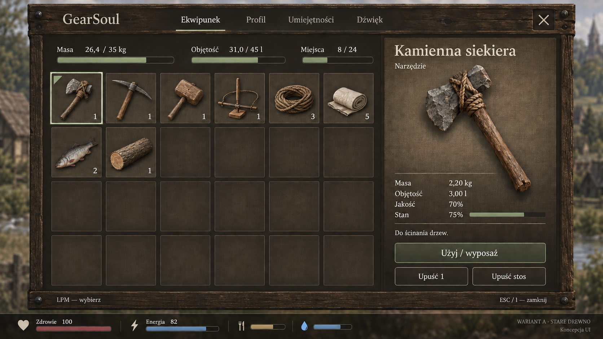
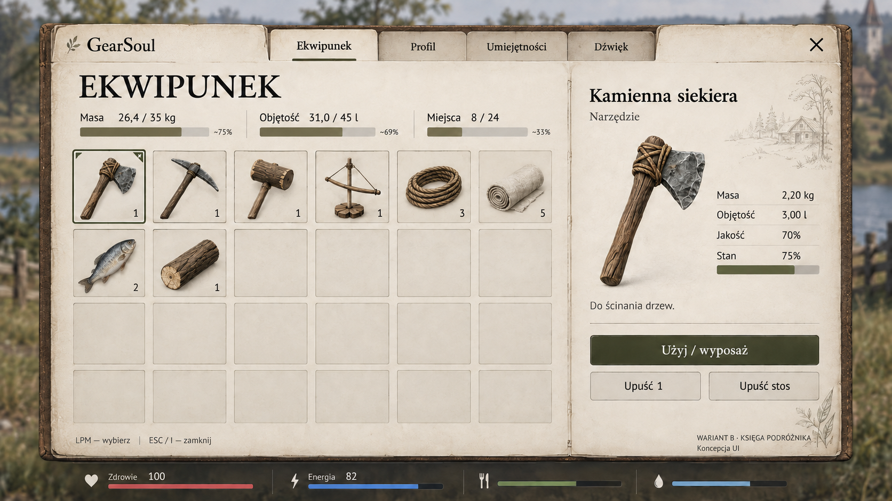
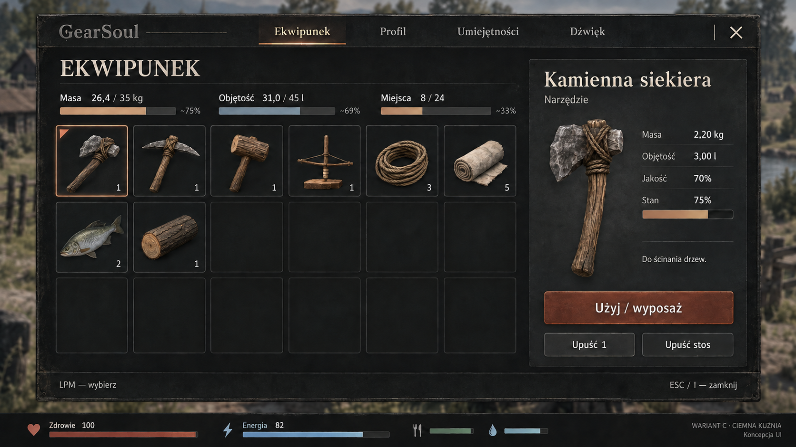
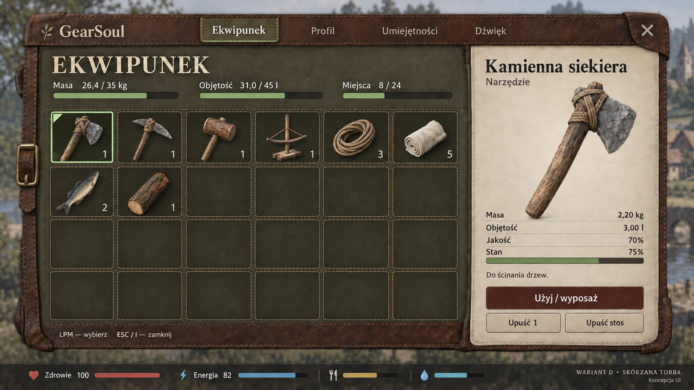

# Wybierz wygląd UI GearSoul — A / B / C / D

## [Zagłosuj w komentarzu: A, B, C albo D](https://github.com/Aniosek/GearSoul-Playtest/issues/1)

Jeden wybór na osobę; jeśli zmieniasz zdanie, edytuj komentarz. To zbieranie opinii, nie automatyczny licznik głosów.

Cztery propozycje tego samego ekwipunku. Chcemy, żeby interfejs pasował do surowego świata pracy i rzemiosła, ale przede wszystkim był wygodny i czytelny.

**To makiety graficzne, nie nowy interfejs już wdrożony w grze.** Paczka 0.9.20 Pre-Alpha pozostaje bez zmian. Etap 100 nadal jest otwarty; to jeszcze nie beta.

## A — Stare drewno

Stary dąb, jasne napisy i zgaszona zieleń. Pęknięcia i faktura na obramowaniu, spokojniejsze pola pod tekstem.

[Otwórz obraz A w pełnym rozmiarze](https://raw.githubusercontent.com/Aniosek/GearSoul-Playtest/main/ui-proposals/2026-09/A_stare_drewno_v2.png)

## B — Księga podróżnika

Jasny papier, ciemny tusz i proste zakładki. Najjaśniejszy kierunek, przypominający księgę podróży i zapasów.

[Otwórz obraz B w pełnym rozmiarze](https://raw.githubusercontent.com/Aniosek/GearSoul-Playtest/main/ui-proposals/2026-09/B_ksiega_podroznika_v2.png)

## C — Ciemna kuźnia

Matowe, czernione żelazo, jasne napisy i niewielkie miedziane akcenty. Oszczędny, ciemny kierunek bez nadmiaru ozdób.

[Otwórz obraz C w pełnym rozmiarze](https://raw.githubusercontent.com/Aniosek/GearSoul-Playtest/main/ui-proposals/2026-09/C_ciemna_kuznia_v2.png)

## D — Skórzana torba

Zużyta skóra, płótno i skromne szwy. Ciepły, podróżniczy charakter z jasnym panelem wybranego przedmiotu.

[Otwórz obraz D w pełnym rozmiarze](https://raw.githubusercontent.com/Aniosek/GearSoul-Playtest/main/ui-proposals/2026-09/D_skorzana_torba_v2.png)

## Co oceniamy?

- Czy łatwo odczytać napisy bez przybliżania?
- Czy od razu widzisz wybrany przedmiot, masę i potrzebną akcję?
- Który styl pasuje do GearSoul? Co przeszkadza: tekstury, ciemność, ramki lub wielkość napisów?

Wspólny scenariusz ma 24 miejsca, osiem zajętych slotów i zaznaczoną kamienną siekierę. Dane oraz ikony są ilustracyjne, nie są zmianą balansu ani nowymi modelami w grze. Głosujemy na kierunek wyglądu, nie mechanikę. Wdrożenie po wyborze wymaga prawdziwych kontrolek, dopasowania rozdzielczości i testów w Unreal Engine.

## Materiały na stronę

W tym folderze są cztery wybrane obrazy PNG serii v2, każdy 1672 × 941 pikseli. [Lista obrazów i bezpośrednie adresy w JSON](variants.json) ułatwia dodanie galerii na stronę. Zachowaj proporcje, pozwól otworzyć pełny obraz, używaj identyfikatorów A/B/C/D i podpisu „Koncepcja UI — nie screenshot aktualnej wersji gry”. Nie rozciągaj ani nie przycinaj makiet.

Obrazy powstały z użyciem generatora obrazów, a następnie przeszły korektę i kontrolę wizualną. Nie są gotowym pakietem widżetów ani deklaracją ręcznego wykonania grafik. Przy publikacji na stronie zachowaj informację, że są to propozycje oprawy.
